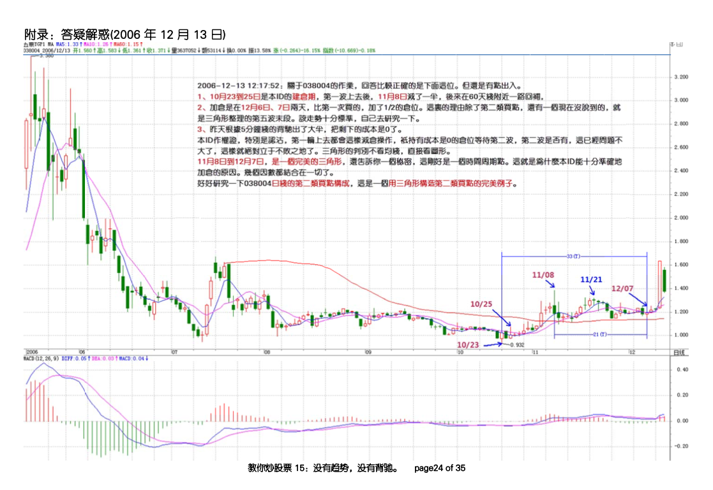
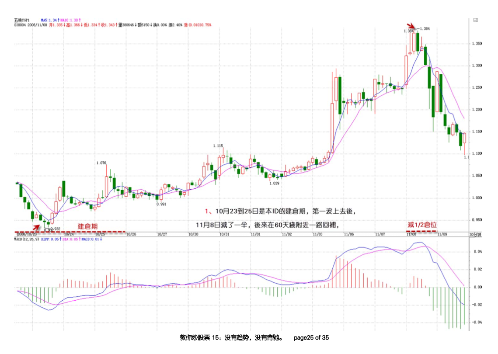
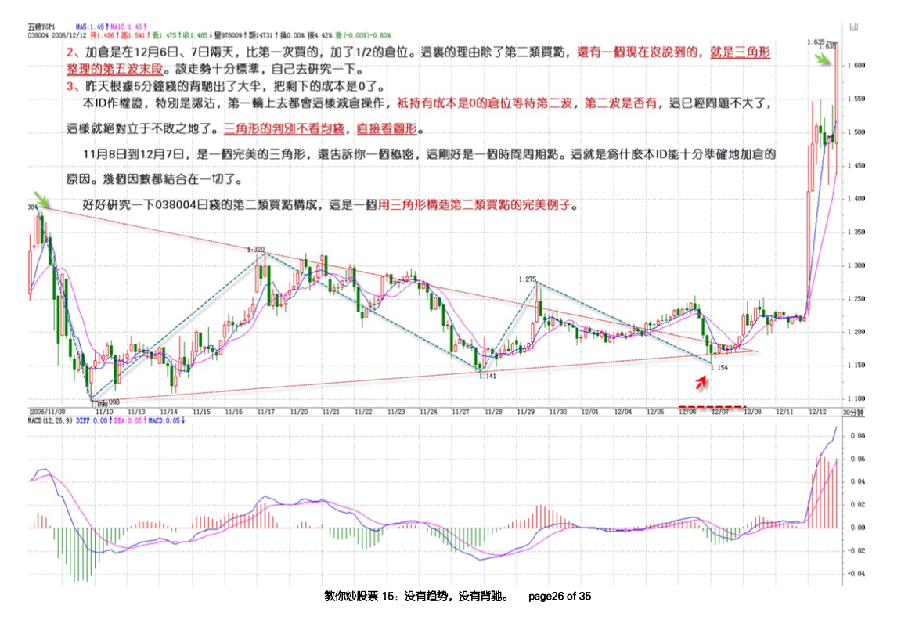

# 波浪理论

---

## 1. 部分提及
### 出自（《教你炒股票15 没有趋势，没有背驰》作业答疑部分）  

  

  

  

## 2. 调整浪的形态
import Drawio from '@theme/Drawio'
import waves from '!!raw-loader!./drawio-graphs/wave.drawio';

<Drawio 
  content={waves}
  page={0}
  zoom={1}
  autoCrop={true}
  toolbar="zoom layers tags lightbox"
/>